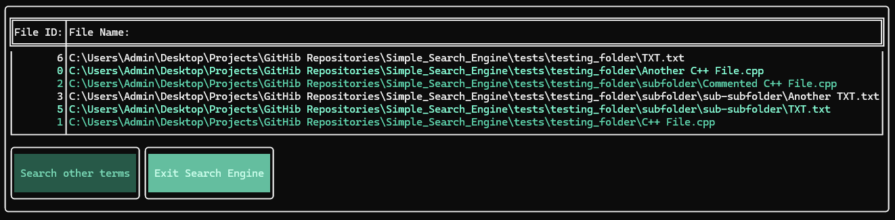
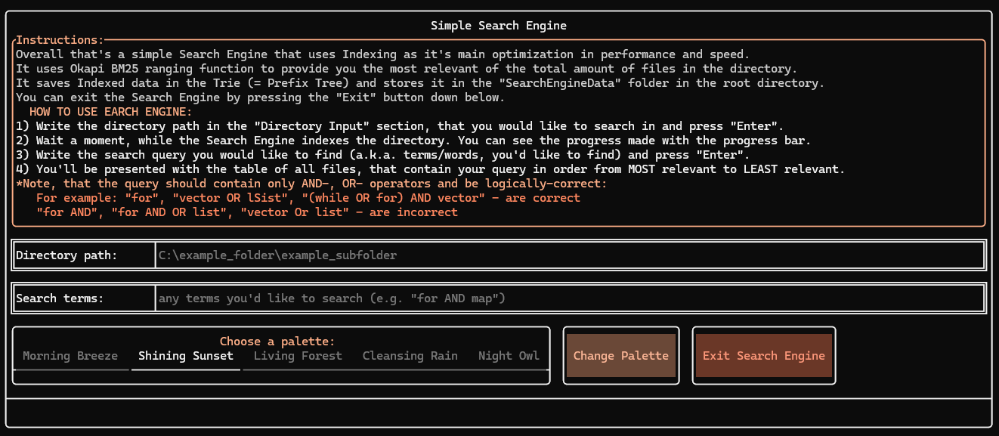

# Simple Search Engine

This project is a [simple full-text search engine](https://en.wikipedia.org/wiki/Full-text_search) application that allows users to search for terms within a directory. The application utilizes [indexing](https://en.wikipedia.org/wiki/Search_engine_indexing) and the [Okapi BM25](https://en.wikipedia.org/wiki/Okapi_BM25) ranking function to deliver the most relevant results efficiently. The indexed data is stored in a [Trie](https://en.wikipedia.org/wiki/Trie) (Prefix Tree) within the "SearchEngineData" folder. The search engine features a user-friendly console interface built with [FTXUI](https://github.com/ArthurSonzogni/FTXUI) and multiple color palettes to customize it.

## Features

- [Indexing](https://en.wikipedia.org/wiki/Search_engine_indexing): The search engine indexes the directory to improve search performance and speed.
- Ranking: Uses the [Okapi BM25](https://en.wikipedia.org/wiki/Okapi_BM25) ranking function to provide the most relevant results.
- [Trie Data Structure](https://en.wikipedia.org/wiki/Trie): Indexed data is stored in a Trie within the "SearchEngineData" folder.
- User Interface: Interactive console UI built with [FTXUI](https://github.com/ArthurSonzogni/FTXUI).
- Color Palettes: Five color palettes available for UI customization

## Color Palettes:
- ### Morning Breeze (default)
    
    
- ### Shining Sunset
    
    
- ### Living Forest
    
    
- ### Cleansing Rain
    
    
- ### Night Owl
    
    

## Dependencies

- [FTXUI](https://github.com/ArthurSonzogni/FTXUI): A simple and modern C++ library for terminal-based user interfaces.
- [Filesystem Library](https://en.cppreference.com/w/cpp/filesystem): For directory traversal and file operations.

## How to Use the Search Engine

### 1. Specify Directory Path:
- Enter the directory path in the **"Directory Input"** section and press "Enter".
- Wait for the indexing process to complete. The progress is shown with a progress bar.
### 2. Enter Search Query:
- Enter the search query in the **"Search terms"** section and press "Enter".
- The results will be displayed in a table, ordered from the most to the least relevant.
### 3. Change Color Palette:
- Choose a color palette you would like to change to.
- Either press the **"Change Palette"** button or continue using the search engine as usual - color palette will update automatically, whenever the engine reloads the UI.

#### Note: The search query should contain only AND, OR operators and be logically correct*:
    Correct examples: "for", "vector OR list", "(while OR for) AND vector"
    Incorrect examples: "for AND", "for AND OR list", "vector Or list"

#### *Incorrect directory path / query will result in an error, which will be shown at the bottom of the search engine and will require user to enter valid directory path / query.


## Integrating Library Into Your Project

Here is the example of how to integrate and use search engine library in your project:

```cpp
#include "../lib/SearchEngine.hpp"

int main() {
    SearchEngine engine;
    engine.Start();
    return 0;
}
```

## Issues And Contributions
For any issues or contributions, please open an issue or pull request on the project's GitHub repository.

## License

This project is licensed under the MIT License. See the [LICENSE](LICENSE.txt) file for details.

© 2024 Simple Search Engine Project. All rights reserved.